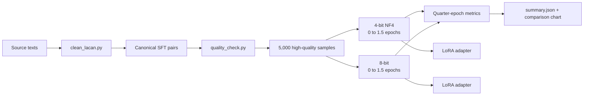
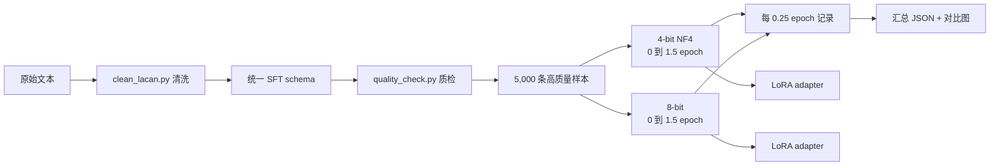

# LacanLLM

LacanLLM is a reproducible SFT/QLoRA project for adapting Gemma 4 E2B to a cleaned Lacanian question-answer dataset.

## Project map



The two training curves are cumulative runs. Each quantization setting starts once from the base model and records evaluation at 0.25, 0.50, 0.75, 1.00, 1.25, and 1.50 epochs.

## Current results

| Run | Samples | Epochs | Final eval loss | GPU |
|---|---:|---:|---:|---|
| 4-bit NF4 | 5,000 | 1.5 | 3.0238 | NVIDIA RTX 5070 |
| 8-bit | 5,000 | 1.5 | 3.0197 | NVIDIA RTX 5070 |

Both runs use 4,750 training rows and 250 validation rows. The 8-bit run achieved a slightly lower validation loss, but took substantially longer.

## Repository map

```text
LacanLLM/
├── data/
│   ├── lacan_sft_pairs_checked.jsonl     # cleaned canonical dataset
│   └── quality_report.json               # schema and quality report
├── scripts/
│   ├── clean_lacan.py                    # clean source text
│   ├── generate_sft_gemma.py             # generate SFT questions
│   ├── quality_check.py                  # schema and sample checks
│   ├── run_pipeline.py                   # data preparation + QLoRA
│   ├── run_experiments.py                # continuous 1.5-epoch runs
│   ├── evaluate.py                       # independent evaluation
│   ├── infer.py                          # single-prompt inference
│   ├── summarize_experiments.py          # aggregate metrics
│   └── plot_experiments.py               # comparison chart
├── adapters/                             # trained LoRA adapters
└── experiments/                          # local logs, metrics, summary, chart
```

## Environment

Windows, Python 3.11, NVIDIA GPU, and the project virtual environment are recommended:

```powershell
.\.venv\Scripts\Activate.ps1
python -m pip install -r requirements.txt
```

Gemma 4 is gated on Hugging Face. Set the token only in the current shell or in your user environment; never commit it:

```powershell
$env:HF_TOKEN = "hf_..."
```

The base model is downloaded from Hugging Face at runtime and is intentionally not included in this GitHub repository.

## Data preparation

```powershell
python scripts\clean_lacan.py
python scripts\generate_sft_gemma.py --model-id google/gemma-4-E2B-it
python scripts\quality_check.py --sample-size 300
```

The canonical schema is JSONL with fields such as `schema_version`, `instruction`, `input`, `output`, `source_file`, `paragraph_index`, and `char_count`. The checked dataset currently contains 46,839 rows; the experiment runner selects the top 5,000 after filtering.

## Continuous training experiments

```powershell
python scripts\run_experiments.py
python scripts\summarize_experiments.py
python scripts\plot_experiments.py
```

The runner performs two cumulative experiments: 4-bit NF4 and 8-bit. It trains from 0 to 1.5 epochs, evaluates every quarter epoch, and saves safety checkpoints every 50 optimizer steps. Interrupted runs can resume from the latest complete checkpoint.

Outputs:

- `experiments\*_metrics.jsonl`
- `experiments\continuous_manifest.jsonl`
- `experiments\summary.json`
- `experiments\quantization_epoch_comparison.png`
- `adapters\gemma4_e2b_*\`

## Inference and evaluation

```powershell
python scripts\infer.py "Explain Lacan's account of desire." `
  --adapter-dir adapters\gemma4_e2b_8bit_continuous_1p5ep_5000

python scripts\evaluate.py `
  --adapter-dir adapters\gemma4_e2b_8bit_continuous_1p5ep_5000 `
  --data-file data\gemma4_e2b_continuous_5000_validation.jsonl `
  --limit 50
```

The included adapters are LoRA weights, not complete base models. Inference requires both the matching Gemma 4 base model and the adapter.

## Reproducibility and limitations

- Training uses `google/gemma-4-E2B-it`, 5,000 selected samples, seed 3407, max sequence length 1024, and gradient accumulation 4.
- The dataset is synthetic SFT data generated from source passages; it is not a manually annotated expert benchmark.
- Independent human evaluation is still needed for theoretical accuracy, citation faithfulness, and hallucination rate.
- Do not commit HF tokens, raw credentials, model cache files, or incomplete checkpoints.

---

# 中文说明

LacanLLM 是一个可复现的 SFT/QLoRA 项目，用于把 Gemma 4 E2B 适配到经过清洗的拉康文本问答数据集。

## 项目地图



两条训练曲线都是连续训练结果。每种量化只从基础模型启动一次，从 0 训练到 1.5 epoch，并在 0.25、0.50、0.75、1.00、1.25、1.50 epoch 记录验证结果。

## 当前结果

| 实验 | 样本数 | epoch | 最终 eval loss | GPU |
|---|---:|---:|---:|---|
| 4-bit NF4 | 5,000 | 1.5 | 3.0238 | NVIDIA RTX 5070 |
| 8-bit | 5,000 | 1.5 | 3.0197 | NVIDIA RTX 5070 |

两组实验均使用 4,750 条训练数据和 250 条验证数据。8-bit 的最终验证 loss 略低，但训练耗时明显更长。

## 环境安装

推荐使用 Windows、Python 3.11、NVIDIA GPU 和项目虚拟环境：

```powershell
.\.venv\Scripts\Activate.ps1
python -m pip install -r requirements.txt
```

Gemma 4 需要 Hugging Face 授权。只在当前 PowerShell 会话或用户环境变量中设置 token，不要提交到 Git：

```powershell
$env:HF_TOKEN = "hf_..."
```

基础模型会在运行时从 Hugging Face 下载，因此不会放入 GitHub 仓库。

## 数据处理

```powershell
python scripts\clean_lacan.py
python scripts\generate_sft_gemma.py --model-id google/gemma-4-E2B-it
python scripts\quality_check.py --sample-size 300
```

正式 schema 使用 JSONL，每行包含 `schema_version`、`instruction`、`input`、`output`、`source_file`、`paragraph_index`、`char_count` 等字段。当前清洗后的主数据集有 46,839 行，实验脚本会过滤并选取其中 5,000 条。

## 连续训练

```powershell
python scripts\run_experiments.py
python scripts\summarize_experiments.py
python scripts\plot_experiments.py
```

脚本会依次执行 4-bit NF4 和 8-bit 两个连续实验，从 0 训练到 1.5 epoch，每 0.25 epoch 评估一次，每 50 个优化器步骤保存一个安全 checkpoint。训练中断后可以从最近的完整 checkpoint 继续。

输出包括：

- `experiments\*_metrics.jsonl`
- `experiments\continuous_manifest.jsonl`
- `experiments\summary.json`
- `experiments\quantization_epoch_comparison.png`
- `adapters\gemma4_e2b_*\`

## 推理与评估

```powershell
python scripts\infer.py "Explain Lacan's account of desire." `
  --adapter-dir adapters\gemma4_e2b_8bit_continuous_1p5ep_5000

python scripts\evaluate.py `
  --adapter-dir adapters\gemma4_e2b_8bit_continuous_1p5ep_5000 `
  --data-file data\gemma4_e2b_continuous_5000_validation.jsonl `
  --limit 50
```

仓库中的 adapter 是 LoRA 增量权重，不是完整基础模型。推理时仍需要匹配的 Gemma 4 基础模型和 adapter。

## 可复现性与限制

- 基础模型为 `google/gemma-4-E2B-it`，使用 5,000 条筛选样本、seed 3407、最大序列长度 1024、梯度累积 4。
- 数据集是根据源文本生成的 synthetic SFT 数据，不是人工专家标注基准集。
- 理论准确性、引用忠实度和幻觉率仍需要独立人工评估。
- 不要提交 HF token、原始凭据、模型缓存、完整基础模型或不完整 checkpoint。
